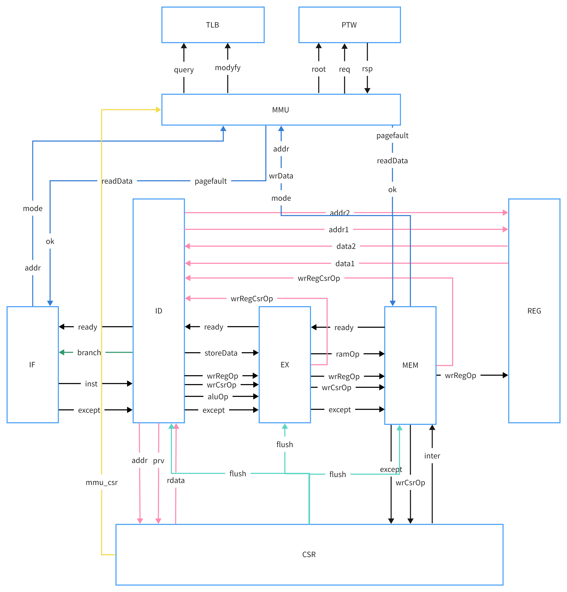

# 计算机体系结构

本仓库的cpu为带mmu和clint的riscv五级流水线cpu，通过此cpu了解计算机运行的最基本机理

### riscv 

riscv手册可参考此网站： https://five-embeddev.com/

### 五级流水cpu

### mmu

+ tlb

+ ptw（可以由软件实现）

### clint与plic

+ clint

+ plic

### dma与通道

+ 轮询

+ 中断

+ DMA

+ 通道

### cache

+ MESI协议

+ cache组织方式

  - vivt

  - pipt

  - vipt

### 外设

通过访问数据寄存器，状态寄存器和命令寄存器控制外设

### 总线

+ 通信协议(AXI4-lite)

+ 仲裁

### 锁的底层实现

riscv的原子指令

